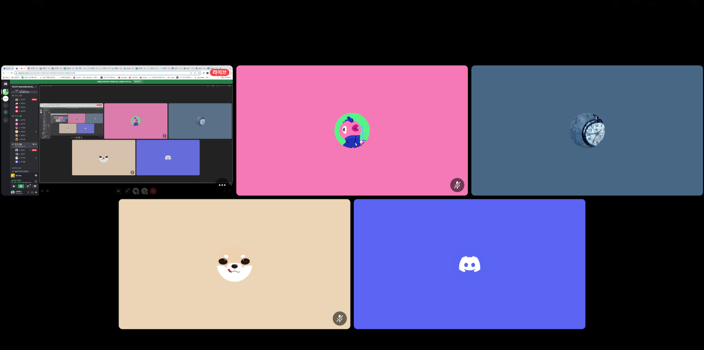

## 팀 구성원, 개인 별 역할

---

1주차 역할

- 최하나: 프로토타입 제작, 발표
- 조성열: ERD 작성, 프로토타입 제작
- 강영구: workflow 작성
- 안주현: 발표 자료 작업
- 홍재평: 약속 프로젝트 아이디어 제안

## 팀 내부 회의 진행 회차 및 일자

---

- 1회차 (2023.09.25) 팀 빌딩 및 아이디어 회의 (모두 참여)
- 2회차 (2023.09.26) 깃허브 레포지토리 생성 & 개발 시작 (모두 참여)
- 3회차 (2023.09.27) 추석 연휴 기간 일정 산정 (모두 참여)
- 4회차 (2023.10.04) 진행상황 점검 (모두 참여)

## 현재까지 개발 과정 요약

---
[기능별 목표]

- 전체적인 프론트엔드 작업(10%) → 아직 디자인 없이 뼈대만 구현
- 약속 리스트 화면(50%)
    - 완료: 전체 리스트를 불러와서 나열, 페이징 기능
    - 예정: 지나간 약속 & 다가올 약속을 나누어서 노출
- 약속 생성 기능(80%)
    - 완료: 약속 제목, 시간, 장소, 메모 입력 후 생성
    - 예정: 비밀방일 경우 패스워드 입력, 장소 명칭으로 검색되도록 (현재는 서울특별시 xxx구 xxx동 이렇게 정확하게 입력해야함)
- 약속 상세 화면(80%)
    - 완료: 약속기본 정보 노출, 약속 장소 지도 첨부, 초대코드, 약속 참여/나가기 기능
    - 예정: 참여자 전체 위치보기 버튼 , 참여자 프로필추가
- 참여자들 위치 정보(10%) / API 사용 방법만 확인하고 아직 구현 전
- 로그인/회원가입:

[팀원 개인 별 성과 자체 평가]

- 최하나
    - Django restframework를 사용해서 API를 만들어서 사용하고 싶었으나 프론트를 장고 템플릿으로 구현할 경우 classview나 함수로 작성해서 사용하는 방법이 더 나았습니다. 초반에 API로 생성했다가 변경하게되어 처음부터 잘 설계하는것의 중요성을 배웠습니다.
    - 카카오 맵 API를 사용하는 방법을 새롭게 알게되었습니다. 카카오의 API문서가 굉장히 잘 작성되어 있어서 앞으로 API문서를 작성한다면 이렇게 작성하면 좋겠다는 점을 배웠습니다.
- 강영구
    - 팀원들이 짠 코드를 보고 Test코드를 작성해보았는데 내가 짠 코드가 아니어서 어려웠던 것도 있지만 Test가 제대로 돌아가지 않아 코드 짜는 실력이 부족하다는걸 느껴 어려움을 느꼈습니다.
    - 팀프로젝트를 하는중 내가 추가로 해야하는 일들을 스스로 찾아 진행을 해야하는데 그러지 못한점이 개인적으로 아쉽습니다.
- 조성열
    - Test 파일을 작성하면서 API가 아닌 classview에 맞춰서 TestCase를 작성하였습니다. classview로 작성하다 보니 테스트코드를 진행할 때 http상태코드를 하나씩 알맞게 지정해줘야 되는 작업을 진행하였습니다.
- 안주현
    - 장고에서 제공하는 auth.USER로 회원가입을 만들었습니다.
    - 로그인과 등록의 api를 사용해보고 jwt를 사용하게되었는데 아직 이해도가 부족해서 수업내용을 토대로 구현해 보았는데 공부가 더 필요할거 같습니다.

## 개발 과정에서 나왔던 질문

---

- 주소 데이터를 입력받아 저장하는 방식: 카카오맵 API를 사용해서 지도에 위치 핀을 그리려면 위도, 경도 정보가 필요한데 유저에게 장소의 위도, 경도를 입력받는것은 사용할 수 없는 UI라고 생각했습니다. 유저한테 편하게 정보를 입력받으면서 이 주소를 어떻게 API에서 사용할 수 있을지 고민했습니다. → 해결: 모델에 주소, 위도, 경도 세가지를 추가하고 유저에게는 주소를 입력 받을 수 있는 창만 띄워 주소를 입력하면 백엔드에서 입력받은 주소지를 카카오 API에 전달하여 위도, 경도값을 받아올 수 있었습니다.
- test파일을 작성하면서 django classview로 작성했을 경우 http상태코드들을 일일히 다 설정해줘야 하는지 아니면 test를 http상태코드를 이용하지 않고 작성하는 방법이 있는지 궁금합니다.

## 개발 결과물 공유

---

Github Repository URL: https://github.com/likelion-backend-6th/wemeet_app/tree/dev 

