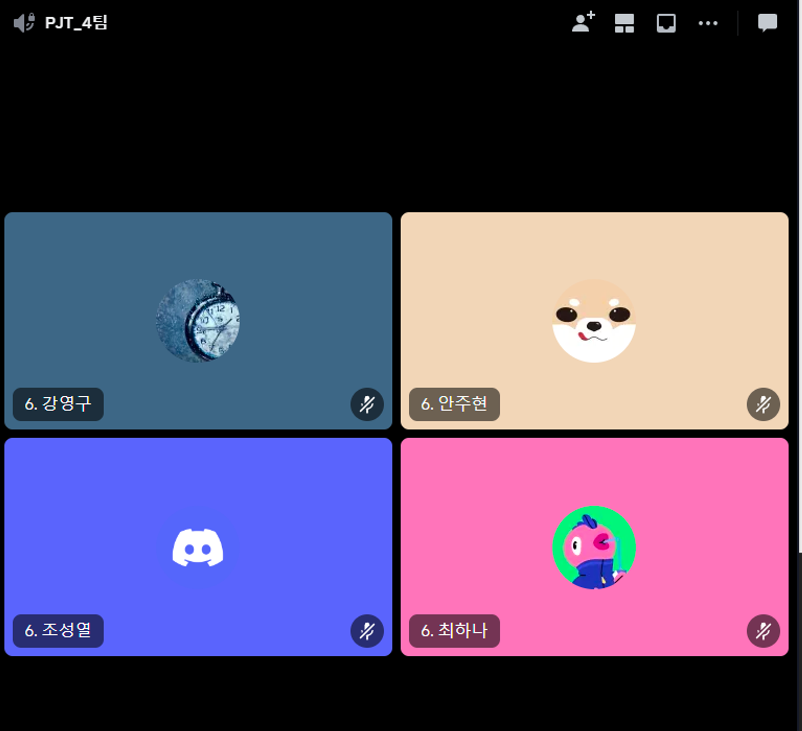
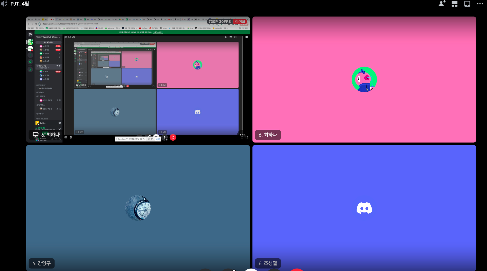

## 팀 구성원, 개인 별 역할

---

3주차 역할

- 최하나: frontend 작업 , 마이페이지 작업
- 조성열: Celery 추가 (메일 발송 기능구현) , celery, redis 배포, Grafana 커스텀 그래프
- 강영구: CICD 분류작업, actions celery수정
- 안주현: 비밀번호 변경, 마이페이지 작업

## 팀 내부 회의 진행 회차 및 일자

---

- (2023.10.16 월): 진행상황 점검 및 계획 공유 (모두 참여)
- (2023.10.17 화): 프로젝트 코칭 진행 & 오류 사항 점검 (모두 참여)
## 현재까지 개발 과정 요약 (최소 500자 이상)

---

[기능별 목표]

- back-end
    - 마이페이지 화면 구현
    - 프론트엔드 적용
    - 셀러리 이메일 발송
    - 위치 실시간으로 업데이트 적용
- devOps
    - 그라파나 마무리 (커스텀 적용)

[팀원 개인 별 성과 자체 평가]

- 최하나
    - (좋은점) 프론트엔드 작업을 하면서, 실제로 유저가 사용할 때 어느지점에서 어색한지 경험하고 로직을 수정할 수 있었습니다.
        - 처음에는 생성 폼과 수정폼을 같은 modelform으로 작업했는데 수정할때 어색한 부분이 있다는걸 확인하고 분리하게 됐습니다.
    - (아쉬운점) 위치 자동 업데이트를 구현하기위해 websocket 방식을 적용하려고 시도했습니다. 위치정보가 업데이트 되는 시점에 자동으로 업데이트 된 위도 , 경도값을 받아오는데까지 성공했으나 이를 동시에 카카오 api와 tmapapi에 전달하고 받는 과정에서 로직이 매우 복잡해져서 이번 스코프에서는 적용하지 않는것이 좋겠다고 결정했습니다.
- 강영구
    - 하나로 작성된 CICD를 CI와 CD로 분리하여 설정하는중에 `IMAGE`뒤에 `tags`가 출력되지않아 포멧에러가 발생, 조건을 수정하고 `timestamp`를 `ENV`로 보내고 있던것을 발견하여 수정 후 해결되었습니다.
    - Test중 `django-celery`없다는 에러를 발견하여 Dockerfile과 docker-compose.yml을 수정해줬지만 기존에 사용하던 `celery`와 충돌이생겨 `django-celery`설치가 안되는 현상 발생, requirement.txt에 사용하던 `django-redis`, `django-celery`는 알고보니 없는? 프로그램이라 수정후 정상작동하는것 같습니다.
- 조성열
    - Celery 와 Redis를 이용해서 메일 발송하는 기능을 helm-chart로 배포하여 django와 연결을 하였습니다.
    - Grafana 커스텀
        - HTTP 상태코드 체크 / DB 쿼리 속도 , 연결 확인 / API 별 접속 확인
- 안주현
    - smtp를 사용해서 이메일로 비밀번호 재설정 기능을 추가하였습니다
## 개발 과정에서 나왔던 질문 (최소 200자 이상)

---

- user_location이 업데이트됐을 때 화면을 새로고침해주어야 이동된 장소로 핀이 찍힘
- Celery를 helm-chart로 배포할 경우 celery에 각각 deployment 파일을 만들어서 배포하는 과정보다 기존 django deployment.yml 파일에 celery를 추가해서 한개의 pod 안에 3개의 컨테이너 (django, celery-worker, celery-beat)를 띄우는 선택을 했습니다.
    
    Celery를 각각 pod로 생성하여 오류가 생길 경우 Celery만 삭제 후 재생성 되는 방법도 좋을꺼 같네요
## 개발 결과물 공유

---

## 개발 결과물 공유

---

Github Repository URL: https://github.com/likelion-backend-6th/wemeet_app/tree/develop 

